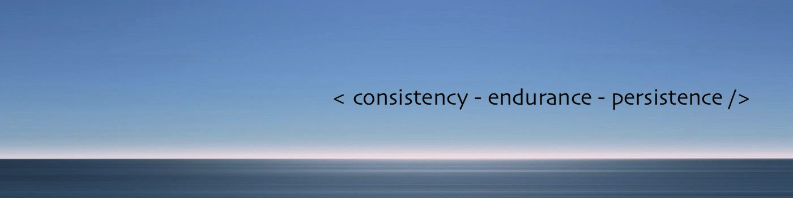

  _%20Rithesh%20N&height=150&fontSize=70&fontAlign=24&fontAlignY=50&font=fira_code&color=ff2200" />

I'm Rithesh N, a passionate developer from India 🇮🇳. I am dedicated to building scalable and secure applications, with a strong focus on Full-Stack Development, Generative AI, and Blockchain. I strive to create impactful, user-focused solutions that address real-world challenges.

- 🌏 My website - [www.rithesh.engineer](https://www.rithesh.engineer)
- ⚡ I’m currently building scalable & secure applications.
- 🧠 I’m currently learning DevSecOps & AI/ML.
- 👾 I’m looking to contribute on Open Source projects.
- ⏩ Ask me about WebDev, System Design, or anything tech!
- 🍃 Check out my resume here: [My Resume](https://drive.google.com/file/d/1qOFkGCBQEZzXyVVruDw3Ca0A8072-Dsq/view?usp=sharing)
- 🍁 **Connect with me:**     

## 📈 Stats ~ 

  

## <h1>Languages and Tools<h1>

  

### 💻 Featured Projects

| Project | Description | Tech Stack | Repository |
| :--- | :--- | :--- | :--- |
| **VoxBiz** | AI Voice-to-Visualization platform with NLP-to-SQL engine. | `MERN`, `GenAI`, `NLP` |  |
| **Shopora** | Scalable E-commerce system with RBAC & Dockerized CI/CD. | `MERN`, `Docker`, `Redux` |  |
| **PlanMyTrip** | Modular backend for travel planning with PDF generation. | `Golang`, `Gin`, `REST` |  |
| **FoodLoop** | Food recovery ecosystem with Blockchain validation & AI logic. | `MERN`, `Solidity`, `AI/ML` |  |

 

<h3><i>"योग: कर्मसु कौशलम्"</i></h3>
  
(<i>Yogah Karmasu Kaushalam</i> : Excellence in action is the ultimate skill)

  
⭐ Feel free to explore my repositories and connect with me! ⭐

  
  

